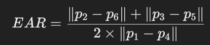

# Blink Detection Using Eye Aspect Ratio (EAR)

This project implements a robust blink detection system using the Eye Aspect Ratio (EAR) with a dynamic threshold based on a baseline EAR. The system is designed to adapt to individual differences in eye shape and size while also incorporating additional checks to detect deepfake artifacts.

## Table of Contents

- [How It Works](#how-it-works)
  - [Eye Aspect Ratio (EAR)](#eye-aspect-ratio-ear)
  - [Baseline EAR](#baseline-ear)
  - [Dynamic Threshold](#dynamic-threshold)
  - [Smoothing EAR Values](#smoothing-ear-values)
  - [Cooldown Period](#cooldown-period)
  - [Eye Movement Detection](#eye-movement-detection)
  - [EAR Consistency Check](#ear-consistency-check)
  - [Reflection Analysis](#reflection-analysis)
  - [Double Blink Detection](#double-blink-detection)
- [Used Formulas](#used-formulas)
- [Code Overview](#code-overview)
- [Key Variables](#key-variables)
- [Usage](#usage)
- [Dependencies](#dependencies)
- [Changelog](#changelog)

## How It Works

### Eye Aspect Ratio (EAR)
The EAR is a metric used to determine whether the eyes are open or closed. It is calculated as:





where `p1` to `p6` are the eye landmark points.

### Baseline EAR
To account for individual differences in eye structure, the system calculates an initial baseline EAR over the first few frames. The EAR value is updated dynamically to create a more adaptive system.

### Dynamic Threshold
Rather than using a fixed threshold, the system determines a dynamic threshold based on the baseline EAR. A blink is detected when the EAR value drops below 75% of the baseline.

### Smoothing EAR Values
Since facial landmark detection can introduce noise, the EAR values are smoothed using a small moving average window.

### Cooldown Period
To prevent false positive blinks from being registered in quick succession, a cooldown period is implemented. After detecting a blink, the system enforces a short delay before allowing another blink to be counted.

### Eye Movement Detection
Using eye landmarks and the nose landmark as a reference, the system tracks eye movements across frames. If unusual eye movement patterns are detected, the system flags it as a potential anomaly.

### EAR Consistency Check
An abrupt change in EAR values during a blink is considered suspicious. The system monitors the rate of change and flags unnatural shifts in EAR.

### Reflection Analysis
Deepfake videos often struggle with realistic eye reflections. The system extracts the eye region and analyzes light reflections. If no reflections are detected, the system raises an alert.

### Double Blink Detection
A double blink is detected when two consecutive blinks occur within a dynamically calculated time window. This helps detect natural human behavior and adds another layer of analysis.

## Used Formulas

### Moving Average Smoothing


### Dynamic Blink Threshold


### EAR Change Detection


## Code Overview

- The system captures video frames using OpenCV and detects faces using `dlib`.
- Facial landmarks are extracted and used to calculate the EAR.
- Blinks are detected based on dynamic thresholds.
- Additional deepfake detection checks are performed.
- The user interface overlays real-time feedback on the video.

## Key Variables

| Variable               | Description |
|------------------------|-------------|
| `BASELINE_FRAMES`      | Number of frames to compute the initial EAR baseline |
| `BLINK_COOLDOWN`       | Time before another blink can be counted |
| `SMOOTHING_WINDOW`     | Number of frames used to smooth EAR values |
| `EAR_CHANGE_THRESHOLD` | Threshold for detecting abrupt EAR changes |
| `VAR_THRESHOLD`        | Threshold for detecting unnatural eye movements |
| `DOUBLE_BLINK_THRESHOLD` | Max time difference between two blinks for a double blink detection |
| `REFLECTION_THRESHOLD`  | Minimum brightness level for valid eye reflections |

## Usage

1. Install dependencies using:
   ```
   pip install -r requirements.txt
   ```
2. Run the script:
   ```
   python blink_detection.py
   ```
3. Look at the camera while the system calculates the baseline EAR.
4. The system will detect blinks and analyze eye behavior in real-time.
5. Press `q` to exit the application.

## Dependencies

- `OpenCV`
- `dlib`
- `numpy`
- `scipy`

## Changelog

### v1.1
- Added `REFLECTION_THRESHOLD` for improved deepfake detection
- Optimized EAR smoothing algorithm
- Improved cooldown logic for more reliable blink detection

### v1.0
- Initial release with EAR-based blink detection and anomaly detection features

